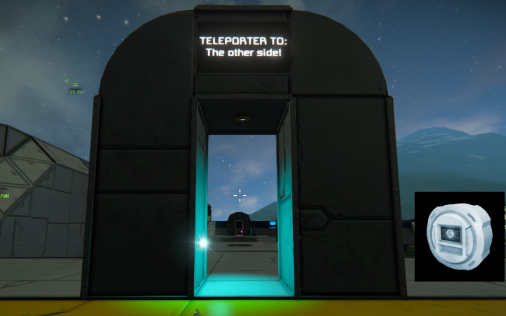

# Short description
A mod for Space Engineers that allows using sensors for teleportation.

# Usage

1. Enable the mod `TeleportingSensor` in the savegame settings.
1. Create two sensors somewhere at two different places.
1. Adjust the both sensor ranges like:

        Left extent  : 0.1 m
        Right extent : 0.1 m
        Bottom extent: 0.1 m
        Top extent   : 0.1 m
        Back extent  : 0.1 m
        Front extent : 1.0 m

1. Edit the Custom Data of the first one:

        teleporter.name=Teleporter 1
        teleporter.target=Teleporter 2

1. Edit the Custom Data of the second one:

        teleporter.name=Teleporter 2
        teleporter.target=Teleporter 1

1. Reach 1.0 meters of range to the front of one sensor.
1. *Bzzzzt!* Find your self 3.0 meters away from the other sensor.

# Building simple teleporter gates

1. Build two gates like on the thumbnail:

        2x steel blocks vertically on the left side
        1x block space
        2x steel blocks vertically on the right side
        1x rounded corner block on the top of each pillar pointing to the center
        1x steel block between the rounded corner blocks
        1x sensor below the center steel block
        1x light on the inner side of the center space
        2x LCDs on the center block showing the destination

1. Adjust the sensors ranges:

        Left extent  : 1.0 m
        Right extent : 1.0 m
        Bottom extent: 1.0 m
        Top extent   : 1.0 m
        Back extent  : 0.1 m
        Front extent : 4.5 m

1. Edit the Custom Data of the first one:

        teleporter.name=Teleporter 3
        teleporter.target=Teleporter 4

1. Edit the Custom Data of the second one:

        teleporter.name=Teleporter 4
        teleporter.target=Teleporter 3

1. Step into the gate.
1. *Bzzzzt!* Find your self in the other teleporter gate.
1. Step out quickly, or you will get into a teleporter loop. *Improve this with `teleporter.offset`!*

# Custom Data (Properties)

## Properties on the sensors

The sensors which shall function as a teleporter need to be configured via its `Custom Data`.

### `teleporter.name` (string)

This `string`-property will define a unique(!) name for the teleporter to identify and use it on another teleporting sensor.

**IMPORTANT:** If this is not given, the sensor will not be identified as a teleporting sensor!

#### Example

`teleporter.name=Teleporter 1`

### `teleporter.target` (string)

This `string`-property will define the name of a teleporting sensor to teleport to. This has to be set on the target sensors Custom Data via `teleporter.name`.

This is optional. If not given, the sensor will be a `receive-only` target.

#### Example

`teleporter.target=Teleporter 2`

### `teleporter.offset` (float,float,float)

This property is a comma-separated vector/list of `float`-values with 3 entries defining an offset 3 meters in front of the sensor to teleport the player to.

This is very useful to adjust the teleportation spots to break teleporter loops or to place the player on a specific block away from the sensor.

**IMPORTANT:** There is no limitation in this offset, so one could use it to teleport the player where ever one likes. To other planets, asteroids or even into empty space. **So be very sensitive with this!**

The first entry will define the offset in meters on the x-axis, the second the offset on the y-axis and the third the offset on the z-axis.

#### How to determine a good offset

1. Stand right before the (disabled) teleporting sensor.
1. Make a new GPS-marker using `New from current position`
1. Go away from the sensor to the position you like to use
1. Make a second GPS-marker using `New from current position`
1. Take the coordinates from the first marker and the second marker and calculate the difference.
1. Enter the offset (maybe rounded) to this property
1. Test it
1. Adjust it

#### Example

`teleporter.offset=0.0,5.0,0.0`

The result of the example would be: `sensor.y + sensor.front.y * 3.0 m + 5.0 m`

That's between 5 and 8 meters away from the sensors front side on the y-axis (depending on the sensors direction / alignment with the y-axis).

# Tested

With Space Engineers Version `1.197.181 default` in Survival with following mods active:

- [HUB Compass](https://steamcommunity.com/sharedfiles/filedetails/?id=1469072169)
- [[Drums] Ore Detectors+ (Vanilla)](https://steamcommunity.com/sharedfiles/filedetails/?id=1687631436)

With Space Engineers Version `1.197.181 default` in Multiplayer with following mods active:

- [Caldari Skybox (DX11)](https://steamcommunity.com/sharedfiles/filedetails/?id=540223802)
- [HUB Compass](https://steamcommunity.com/sharedfiles/filedetails/?id=1469072169)
- [Water mod](https://steamcommunity.com/sharedfiles/filedetails/?id=2200451495)
- [Octave (NO MUSIC)](https://steamcommunity.com/sharedfiles/filedetails/?id=2198167491)
- [Planet Aquaras (uses water mod) Easter eggs update!](https://steamcommunity.com/sharedfiles/filedetails/?id=2217031815)
- [[Drums] Ore Detectors+ (Vanilla)](https://steamcommunity.com/sharedfiles/filedetails/?id=1687631436)

For Multiplayer there is one (yet) known issue: [issues/6][issues/6]

# Steam Workshop

[https://steamcommunity.com/sharedfiles/filedetails/?id=2451488811](https://steamcommunity.com/sharedfiles/filedetails/?id=2451488811)
